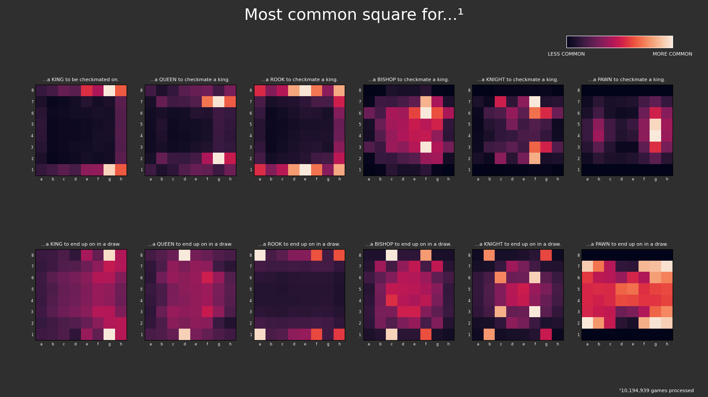

# Chess Visualizer

**Chess Visualizer** is a tool for analyzing spatial trends in chess games. It extracts final board positions from a large set of games and visualizes those positions using heatmaps. The visualization focuses on two specific outcomes: checkmate and draw.

This project is built to demonstrate the capabilities of [`walia6/chesslib`](https://github.com/walia6/chesslib), a pure Java chess engine and utility library used to parse, validate, and analyze chess positions at scale.



---

## Key Features

- Parses millions (even billions) of PGN games and processes them concurrently.
- Visualizes where specific pieces tend to end up in games that end in checkmate or a draw.
- Renders a 2×6 grid of heatmaps (King, Queen, Rook, Bishop, Knight, Pawn × checkmate/draw outcomes).
- Cleanly integrates Java and Python through a simple pipeline.

---

## Project Layout

```
.
├── generate_heatmap.sh        # Script to run analysis + visualization
├── java/
│   └── analyzer/              # Java backend using chesslib
├── python/
│   └── visualizer.py          # Python visualization logic
├── output.png                 # Example output image
├── LICENSE
```

---

## Setup

### 1. Clone & Install `chesslib`

This project depends on [`chesslib`](https://github.com/walia6/chesslib). Clone it and install it locally:

```bash
git clone https://github.com/walia6/chesslib.git
cd chesslib
mvn clean install
```

### 2. Clone & Build This Project

```bash
git clone https://github.com/walia6/chessvisualizer.git
cd chessvisualizer
mvn clean package -f java/analyzer/pom.xml
```

### 3. Install Python Dependencies

```bash
pip install matplotlib numpy
```

---

## Getting Game Data

This repository does **not** include a PGN file. To fetch your own dataset, visit the official Lichess database:

- [https://database.lichess.org/](https://database.lichess.org/)

You can download and decompress PGN files in one command using `curl` and `zstdcat`:

```bash
curl -s https://database.lichess.org/standard/lichess_db_standard_rated_2014-07.pgn.zst | zstdcat > games.pgn
```

---

## Usage

### Standard Usage (with a saved PGN file)

```bash
chmod +x generate_heatmap.sh
./generate_heatmap.sh games.pgn output.png
```

This runs the Java analyzer and pipes its output into the Python visualizer. The heatmap is saved as `output.png`.

### Alternative: Stream PGNs Without Saving to Disk

To avoid storing a massive `.pgn` file on disk, you can use a named pipe:

```bash
mkfifo stream.pgn
```

Then run the analyzer in one terminal:

```bash
./generate_heatmap.sh stream.pgn output.png
```

And in another terminal, stream the PGNs directly into the pipe:

```bash
curl -s https://database.lichess.org/standard/lichess_db_standard_rated_2014-07.pgn.zst | zstdcat > stream.pgn
```

This streams data through the analyzer and visualizer in real-time without writing the full PGN to disk.

---

## License

MIT-0 — see `LICENSE`.
