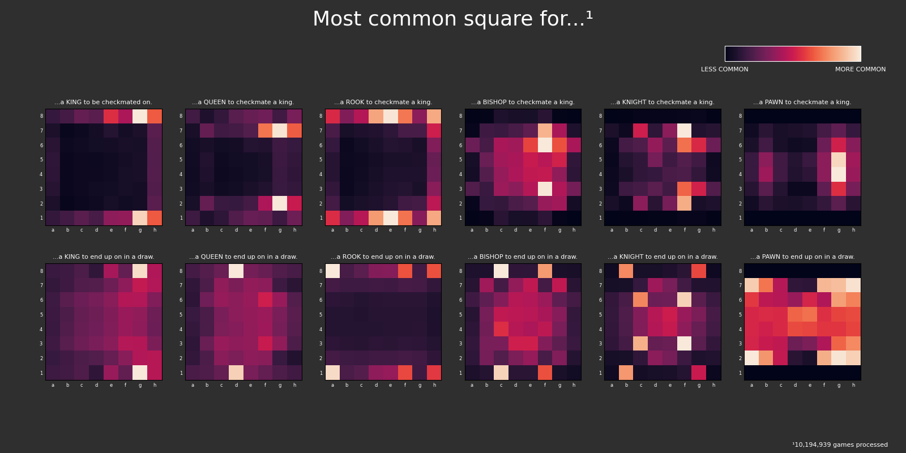

# Chess Visualizer

**Chess Visualizer** is a tool for analyzing spatial trends in chess games. It extracts final board positions from a large set of games and visualizes those positions using heatmaps. The visualization focuses on two specific outcomes: checkmate and draw.

This project is built to demonstrate the capabilities of [`walia6/chesslib`](https://github.com/walia6/chesslib), a pure Java chess engine and utility library used to parse, validate, and evaluate chess positions at scale.




---

## Key Features

- Parses thousands of PGN games and processes them concurrently.
- Visualizes where specific pieces tend to end up in games that end in checkmate or a draw.
- Renders a 2×6 grid of heatmaps (King, Queen, Rook, Bishop, Knight, Pawn × checkmate/draw outcomes).
- Cleanly integrates Java and Python through a simple pipeline.

---

## Project Layout

```
.
├── generate_heatmap.sh        # Script to run analysis + visualization
├── java/
│   └── analyzer/              # Java backend using chesslib
├── python/
│   └── visualizer.py          # Python visualization logic
├── output.png                 # Example output image
├── LICENSE
```

---

## Setup

### 1. Clone & Install `chesslib`

This project depends on [`chesslib`](https://github.com/walia6/chesslib). Clone it and install it locally:

```bash
git clone https://github.com/walia6/chesslib.git
cd chesslib
mvn clean install
```

### 2. Clone & Build This Project

```bash
git clone https://github.com/walia6/chessvisualizer.git
cd chessvisualizer
mvn clean package -f java/analyzer/pom.xml
```

### 3. Install Python Dependencies

```bash
pip install matplotlib numpy
```

---

## Getting Game Data

This repository does **not** include a PGN file. To fetch your own dataset, visit the official Lichess database:

- [https://database.lichess.org/](https://database.lichess.org/)

You can use `curl` and `zstdcat` to download and decompress a PGN in one command. For example:

```bash
curl -S https://database.lichess.org/standard/lichess_db_standard_rated_2014-07.pgn.zst | zstdcat > games.pgn
```

This will create a `games.pgn` file from the July 2014 rated standard games.

---

## Usage

From the project root:

```bash
./generate_heatmap.sh games.pgn output.png
```

This will run the Java analyzer and pipe its output into the Python visualizer. The final heatmap will be saved to `output.png`.

---

## License

MIT-0 — see `LICENSE`.
